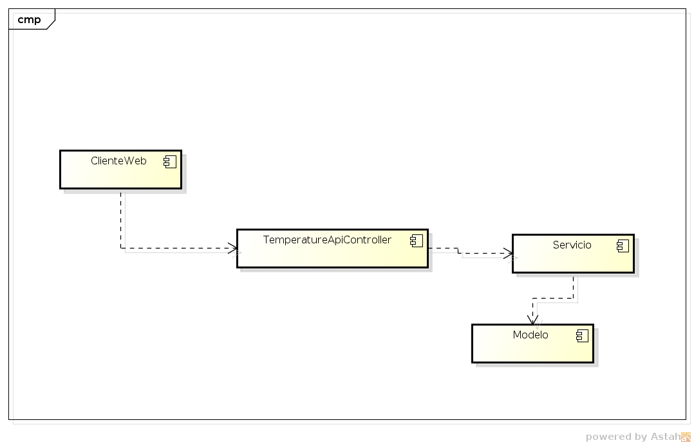
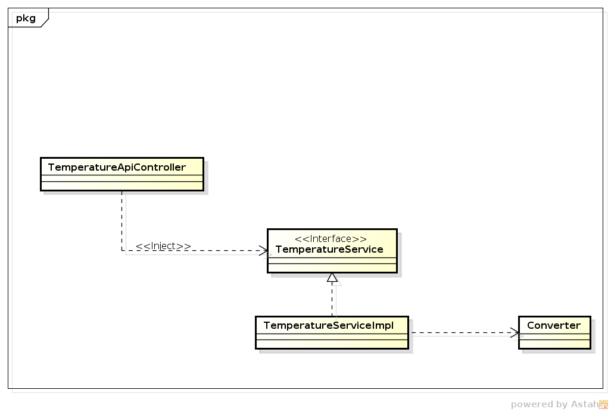
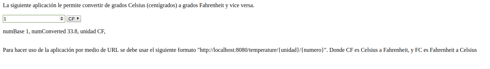

# Escuela Colombiana de Ingeniería
## ARSW - 3 Parcial
## Jonathan Prieto
### Aplicación en Heroku
 - [Link Heroku](https://arsw03parcial.herokuapp.com/)
---
#### Descripción arquitectura
La siguiente aplicación expone un servicio que permite al usuario convertir de grados Celsius (centígrados) a grados Fahrenheit y vice versa.

- La arquitectura principal se fundamenta en MVC.

- Como se puede ver en la imágen anterior, hay un (TemperatureApiController) controlador que se encarga de gestionar los servicios que ofrece la interfaz (TemperatureApiController) por medio de inyección de dependencias. Además la clase que implementa dicha interfaz hace uso de la clase modelo (Converter) la cuál contiene las funciones para realizar las respectivas conversiones. Gracias a éste, para futuros trabajos se puede implementar nuevas funciones a esta clase, lo que nos permite escalar sobre la aplicación.

- Por el lado de la vista, y como se puede apreciar en la imágen anterior, se usa una página de inicio en la que se puede hacer uso del servicio antes descrito.

